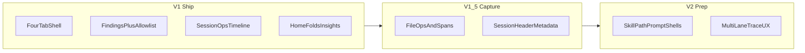

# UI Product Roadmap: Enterprise-shaped local dashboard

**Product:** TelemetryIQ (local-first edition evolving toward enterprise SaaS IA)  
**Stack:** Go `html/template` + HTMX ([ADR 0002](../decisions/0002-go-htmx-local-dashboard.md))  
**Status:** Planning artifact (Quick Flow)  
**Date:** 2026-09-15  
**Reference UX:** TraceLens-style Governance Policies + Session Trace mocks (IA and density only; branding stays TelemetryIQ)

This roadmap prepares the dashboard for an enterprise SaaS information architecture while remaining a **local Go/HTMX** app. It does **not** greenfield a React SPA or dark-theme rewrite in V1.

Source of truth for product behaviour remains [PRODUCT_MAP.md](../../PRODUCT_MAP.md) (§0 reorientation, §17 dashboard IA, privacy invariants). Where this roadmap narrows nav for enterprise prep, treat it as the **UI delivery plan**; update PRODUCT_MAP §17 when V1 ships.

---

## 1. Decisions locked

| Decision | Choice |
|----------|--------|
| Planning mode | Quick Flow (durable doc + GitHub issues) |
| Stack | Evolve Go/HTMX; match mock *structure*, not pixel SPA |
| Primary nav | **Home · Sessions · Governance · Integrations** |
| Folded surfaces | Insights → Home; Privacy → Integrations (or footer); Costs → session detail / secondary link |
| Governance V1 | Findings UI **plus** MCP allowlist checkboxes + Save |
| Governance V1 non-goals | Enforce / publish / multi-tenant policy sets / environments |
| Privacy | No conversation/prompt replay by default; cost never on Home |
| Branding | TelemetryIQ (TraceLens is reference only) |

**“Allowed” semantics (V1):** checkbox membership in `governance.mcp_allowlist` drives **detect-and-report** (`unapproved-mcp`). It does **not** block agents at runtime.

---

## 2. Current baseline

### 2.1 UI today

| Route | Status |
|-------|--------|
| `/` Home | Implemented — orchestration, behaviour, governance, and integration highlights (#150) |
| `/sessions`, `/sessions/{id}` | Implemented — scoped list, operation-aware timeline, and session governance checklist (#153) |
| `/insights` | Implemented detailed secondary route — Home carries headline content; this route preserves PRODUCT_MAP §17.3 evidence tables |
| `/integrations` | Implemented — capability matrix headlines, last-seen tools, Cursor Enterprise status (#154) |
| `/privacy`, `/costs` | Implemented |
| `/governance` | Implemented — risky-access + unapproved-MCP findings (#151) |

Primary nav: Home · Sessions · Governance · Integrations. Privacy and Costs are
secondary destinations; Home omits the Costs link. See
[internal/ui/templates/partials.html](../../internal/ui/templates/partials.html).

### 2.2 Data & APIs

| Signal | SQLite / API | UI |
|--------|--------------|-----|
| Sessions / events | `sessions`, `events` (~7.3k / ~29k locally sampled) | Yes — #163 adds primary/observation scopes so content-derived evidence stays inspectable without dominating the default list |
| Operations | `operations` (~1.2k) + timeline projection | Yes — observed category, qualified tool, duration, and outcome render on operation timeline entries (#153) |
| Cost records | `cost_records` | Costs page only |
| MCP inventory / skills / model / context / ops insights | `GET /api/v1/insights/*` | Headline summaries on Home; detailed evidence on Insights (#150) |
| Risky access | `GET /api/v1/insights/risky-access` | Yes — `/governance` plus a session-scoped checklist over the full retained session event set (#151, #153) |
| Unapproved MCP | `GET /api/v1/insights/unapproved-mcp` | Yes — `/governance`; Save reloads findings immediately; session detail preserves unconfigured/indeterminate policy state (#151–#153) |
| MCP allowlist config | `governance.mcp_allowlist` YAML | Checkbox editor atomically persists and reloads local policy (#152) |
| File operations | Capability matrix mostly `unknown` | No Files lane |
| OTEL span trees | Claude spans in event extensions (partial) | No span UI |
| Conversation bodies | Privacy default: prompts/responses off | Intentionally absent |

Local DB path: `{UserConfigDir}/telemetryiq/telemetryiq.db`.

### 2.3 Related open issues

- [#148](https://github.com/t4avenger/AI-Engineering-productivity/issues/148) — **This roadmap’s epic** (`ui-enterprise`); V1 children #149–#155 closed
- [#71](https://github.com/t4avenger/AI-Engineering-productivity/issues/71) — Dashboard UX epic (partially completed; residual scope points to #148)
- [#79](https://github.com/t4avenger/AI-Engineering-productivity/issues/79) — Integrations capability-backed value (superseded by #154)
- [#87](https://github.com/t4avenger/AI-Engineering-productivity/issues/87) — Claude Code full capture
- [#109](https://github.com/t4avenger/AI-Engineering-productivity/issues/109) — Codex full capture
- [#128](https://github.com/t4avenger/AI-Engineering-productivity/issues/128) — Cursor Enterprise OTEL

---

## 3. Mock → TelemetryIQ IA mapping

| TraceLens mock | TelemetryIQ V1 | Notes |
|----------------|----------------|-------|
| Overview | Home | Behaviour/efficiency + governance highlights; no cost |
| Sessions / Session Trace | Sessions | Ops-aware timeline first; multi-lane in V2 |
| Governance Policies | Governance | Findings + MCP allowlist Save; no Publish/Enforce |
| Integrations (implied via MCP table) | Integrations | Observed tools, capability matrix, setup |
| Pull Requests / Models nav | Deferred | Not in V1–V2 primary nav |
| Conversation lane (prompt text) | Out of scope (default) | Privacy invariant |
| Policy Publish / Enforced / environments | Stage 4 enterprise | Not V1 |

PRODUCT_MAP §17.5 Governance (policy events, severity, status, evidence, indeterminate) is the V1 contract for the Governance page.

---

## 4. Phases

### V1 — Enterprise-shaped local UI (current data)

Ship the four-tab shell, fold Insights onto Home, add Governance findings + MCP allowlist Save, deepen Sessions timeline and Integrations, add Playwright coverage.

### V1.5 — Capture so UI lanes can grow

Close capability gaps (file ops, span projection, session header metadata) via capture/normaliser work; link existing epics rather than duplicating.

### V2 — Mock density (still Go/HTMX)

Multi-lane session trace; Governance tab shells for skills/paths/prompt protection with honest `unavailable`; optional density/sidebar visual pass (ADR if dark theme becomes default). Still no runtime enforce/publish.

---

## 5. V1 MCP allowlist Save design

**Goal:** Operator can tick observed MCP servers as allowed and persist that list locally.

1. Governance page lists observed MCP identities (from MCP inventory insight) as checkboxes; pre-check names present in `governance.mcp_allowlist`.
2. `POST /governance/mcp-allowlist` (session cookie / Bearer, loopback) accepts selected names.
3. Validate with existing config rules (no blank entries).
4. **Write** local config YAML (`governance.mcp_allowlist`) — new `config.Save` (or equivalent) path; today only `Load` exists in [internal/config/config.go](../../internal/config/config.go).
5. Reload in-process config used by governance readers (or document one restart if reload is deferred — prefer in-process reload).
6. Re-render findings (`unapproved-mcp`) and flash success.

Empty allowlist remains **indeterminate** (existing engine behaviour). This is detect-and-report only.

---

## 6. Data readiness matrix

| Enterprise surface | Data | API | UI V1 target |
|--------------------|------|-----|--------------|
| Home KPIs (sessions, tools, insights) | High | Medium | Fold Insights; add gov counts |
| Session list + ops timeline | High | High | Surface ops fields already projected |
| Governance findings | High | High | New `/governance` page |
| MCP allowlist edit | Medium | Missing Write | Checkbox + Save |
| Files lane | Low | Low | V1.5 capture first |
| Span tree | Medium (Claude) | Low | V1.5 projection + V2 UI |
| Conversation replay | Low (privacy) | Low | Non-goal |
| Skill/path/prompt policy CRUD | Low | Low | V2 shells only |
| Integrations management | Medium | Low | Deepen observe + setup |

---

## 7. Acceptance criteria (epic)

- [x] Primary nav is Home · Sessions · Governance · Integrations only (#149, #155).
- [x] Insight headline content is rendered on Home; anchored `/insights` links preserve detailed evidence and backward compatibility (#150).
- [x] Privacy and Costs remain reachable without top-nav slots (#149, #155).
- [x] `/governance` shows risky-access and unapproved-mcp with evidence and honest indeterminate (#151, #155).
- [x] MCP allowlist checkboxes + Save persist to local config and affect findings (#152).
- [x] Session timeline shows operation category/tool/duration/outcome when present (never invent zeros) and session governance stays scoped and honest (#153).
- [x] Integrations shows capability-backed status (addresses #79 intent).
- [x] Playwright live-data e2e covers Governance visibility + allowlist save round-trip + nav IA (#155).
- [x] Privacy invariants and “no cost on Home” preserved (#150, #155).

---

## 8. Issue index

Epic: [#148](https://github.com/t4avenger/AI-Engineering-productivity/issues/148) · label `ui-enterprise`

| Phase | Issue | Title |
|-------|-------|-------|
| Epic | [#148](https://github.com/t4avenger/AI-Engineering-productivity/issues/148) | `[EPIC] UI: enterprise-shaped Go/HTMX IA (Home · Sessions · Governance · Integrations)` |
| V1 | [#149](https://github.com/t4avenger/AI-Engineering-productivity/issues/149) | Four-tab shell + nav |
| V1 | [#150](https://github.com/t4avenger/AI-Engineering-productivity/issues/150) | Home folds Insights + governance / integration highlights |
| V1 | [#151](https://github.com/t4avenger/AI-Engineering-productivity/issues/151) | Governance findings page |
| V1 | [#152](https://github.com/t4avenger/AI-Engineering-productivity/issues/152) | MCP allowlist checkboxes + Save |
| V1 | [#153](https://github.com/t4avenger/AI-Engineering-productivity/issues/153) | Sessions timeline ops + governance checklist |
| V1 | [#154](https://github.com/t4avenger/AI-Engineering-productivity/issues/154) | Integrations deepen (supersedes #79 intent) |
| V1 | [#155](https://github.com/t4avenger/AI-Engineering-productivity/issues/155) | Playwright e2e for IA + Governance |
| V1.5 | [#156](https://github.com/t4avenger/AI-Engineering-productivity/issues/156) | File-ops fixtures / matrix for Files lane |
| V1.5 | [#157](https://github.com/t4avenger/AI-Engineering-productivity/issues/157) | Span-tree projection API for session UI |
| V1.5 | [#158](https://github.com/t4avenger/AI-Engineering-productivity/issues/158) | Session header metadata (branch/PR/entrypoint) |
| V2 | [#159](https://github.com/t4avenger/AI-Engineering-productivity/issues/159) | Multi-lane session trace UX |
| V2 | [#160](https://github.com/t4avenger/AI-Engineering-productivity/issues/160) | Governance tab shells (skills / paths / prompt) |
| V2 | [#161](https://github.com/t4avenger/AI-Engineering-productivity/issues/161) | Visual density / optional sidebar pass |

---

## 9. Explicit non-goals (this roadmap)

- Runtime policy enforcement / block at the agent
- Multi-environment Publish workflow
- Prompt/response conversation replay under default privacy
- Replacing Go/HTMX with a SPA
- Making cost a Home headline
- TraceLens branding or Pull Requests / Models top-level nav in V1–V2

---

## 10. Next implementation step

V1 is closed (#149–#155). Next work is **V1.5 capture** so Session Trace lanes can grow honestly:

1. **#156** — File-operation fixtures + capability matrix (blocker for a Files lane).
2. **#157** — Span-tree projection API for session UI.
3. **#158** — Session header metadata (branch / PR / entrypoint) when providers emit it.
