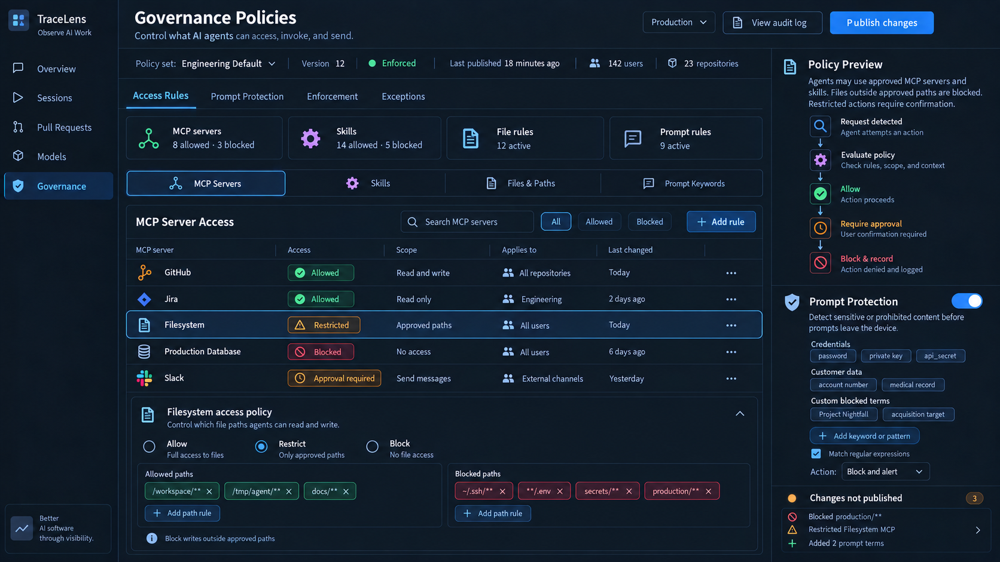
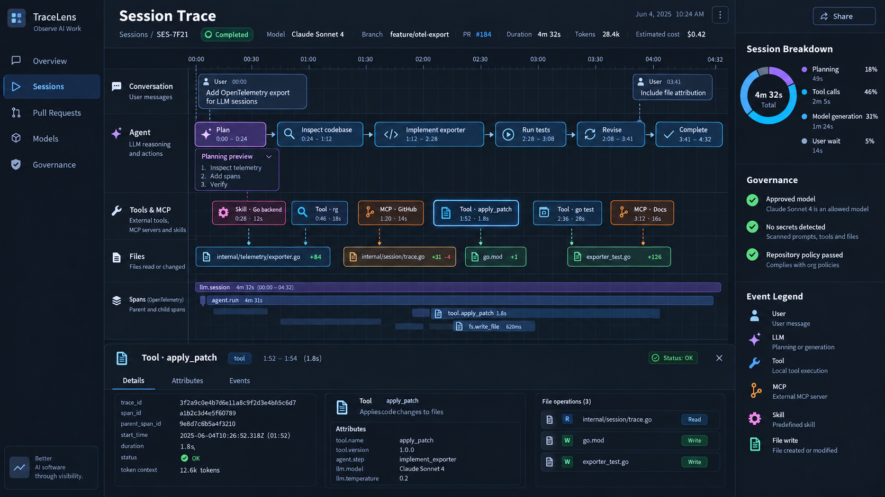

# Original UI design references

User-supplied images, copied unchanged on 2026-09-19. These are acceptance
references for [the roadmap](../UI_PRODUCT_ROADMAP.md) and
[the specification](../DESIGN_IMPLEMENTATION_SPEC.md), not production data.

| Asset | Original filename | SHA-256 |
|---|---|---|
| [Governance Policies](governance-policies.png) | ChatGPT Image Sep 15, 2026, 09_17_41 PM.png | `263e7e7d92d1de6f81d195393b15e14326ed8989ccfa32e3290109d7547641bd` |
| [Session Trace](session-trace.png) | ChatGPT Image Sep 15, 2026, 09_04_33 PM.png | `2a37c6a7b637e0f40055ee40bab3af411f5cf504f55b450d751b70ebc1551745` |

## Intentional differences

- TelemetryIQ branding replaces TraceLens. Names, dates, counts and percentages
  are illustrative, never data defaults.
- The dark sidebar and five destinations are required. Integrations, Insights,
  Privacy and Costs remain utilities; Costs is absent from Overview.
- Show raw retained conversation content locally with honest provider gaps;
  do not invent planning/reasoning or diagnostic disclosure.
- Local governance detects/reports. Enforcement, approvals, publishing,
  environments, shared scope and sharing require explicit future gates.
- Accessibility, responsive layout and evidence honesty override decorative pixels.
  Record deviations by specification ID. Keep implementation screenshots separate.

## Governance Policies

## Session Trace

